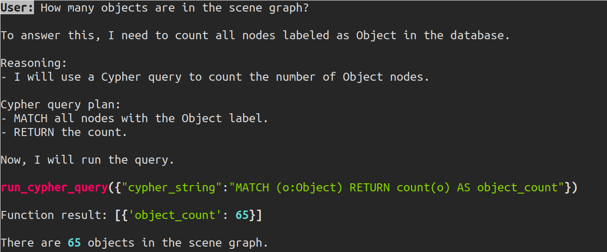

# Heracles Agents

`heracles_agents` is a minimal agentic LLM framework. It has been developed
with a focus on the following priorities:

* Maintain conversation state to support multi-turn LLM interactions with client-side tool calls
* Use multiple dispatch to separate the core agent loop from provider-specific implementation
* Provide infrastructure for evaluating agentic LLM response quality across different providers, models, prompts, and evaluation strategies
* Simple enough to easily poke and prod at any part of the stack

The `heracles_agents` library should be flexible enough to be directly
integrated in other downstream applications. In this repository we provide two
example uses:
* An interactive agent that allows the user to query and update a 3D scene graph and send goals to robots, and
* An experimental pipeline built to evaluate agentic LLM responses for different providers, models, prompts, and evaluation strategies.
See the Examples section below for more detail on these programs.



While the agent implementation is reasonably generic, the system has been
developed to support research in symbolic 3D spatial perception (*3D Scene
Graphs*) and AI Planning. To that end, we provide LLM tools for
* [Executing Cypher queries against a graph database](src/heracles_agents/tools/cypher_query_tool.py)
* [Sending PDDL goals to robots](src/heracles_agents/tools/pddl_calling_tool.py)
* [Sending waypoints to quadrotors](src/heracles_agents/tools/penn_integration_tool.py)
* [Highlighting objects of interest in a 3D scene graph](src/heracles_agents/tools/visualize_objects_tool.py)


## Installation

Note that this repo requires Python 3.12 and has only been tested on Ubuntu
24.04. It should work on Ubuntu 22.04, as long as you don't use the ROS
functionality.

While `heracles_agents` can be used as a standalone minimal agent framework,
you probably want to also install `heracles`, which provides an interface
between 3D scene graphs and a graph database.

First, we'll install `heracles`:
```bash
git clone git@github.com:GoldenZephyr/heracles.git
pip install ./heracles/heracles
```

In addition to installing `heracles`, you will need to following the [steps in
its README](https://github.com/GoldenZephyr/heracles) for running the graph
database and installing `spark_dsg` if you would like to use the scene graph
functionality.


Next, instead `heracles_agents`:
```bash
git clone git@github.com:GoldenZephyr/heracles_agents.git
pip install heracles_agents
```

### Heracles ROS

If you intend to use Heracles as part of a ROS-based system, you can put
`heracles` and `heracles_agents` in your ROS workspace instead of
pip-installing them manually, as long as your virtual environment was created
with the `--system-site-packages` option (which you would want anyway).

### Environment Variables

| Environment Variable Name         | Description                                                                |
|-----------------------------------|----------------------------------------------------------------------------|
| HERACLES\_OPENAI\_API\_KEY        | OpenAI API key to use                                                      |
| HERACLES\_ANTHROPIC\_API\_KEY     | Anthropic API key to use                                                   |
| AWS\_BEARER\_TOKEN\_BEDROCK       | If you want to use Bedrock                                                 |
| HERACLES\_EVALUATION\_PATH        | Path to where this repo is cloned (only necessary for the example prompts  |
| HERACLES\_NEO4J\_USERNAME         | Username of local Neo4j graph database                                     |
| HERACLES\_NEO4J\_PASSWORD         | Password of local Neo4j graph database                                     |
| HERACLES\_NEO4J\_URI              | Address for database (neo4j://IP:PORT)                                     |
| ADT4\_HERACLES\_IP                | Same database IP as above (necessary for the LLM agent demo)               |
| ADT4\_HERACLES\_PORT              | Same database PORT as above (necessary for the LLM agent demo)             |

## Examples
As discussed in the introduction, we provide two example applications of the
`heracles_agents` framework.

### Chatdsg

[chatdsg.py](examples/chatdsg/chatdsg.py) is a simple terminal-based interface
to a tool-enabled LLM agent. The agent can answer questions or make updates to
a 3D scene graph if you have an instance of
[heracles](https://github.com/GoldenZephyr/heracles) running. You can also send
PDDL goals to an instance of
[Omniplanner](https://github.com/MIT-SPARK/Omniplanner), or highlight scene
graph objects of interest in Rviz. You can modify the LLM model or tools that
are used [in the config file](examples/chatdsg/agent_config.yaml), or [change the
prompt file](examples/chatdsg/agent_prompt.yaml).

### Experiment Pipelines

TODO


## Custom Tools

Adding new tools for an LLM to use is quite straightforward. Currently, the
function metadata presented to the LLM is explicitly annotated external to the
function definition (as opposed to relying on inline annotation). We believe
this encourages reuse of existing functions and code that is easier to read.

Given a function (in this case `the_might_favog`), it can be annotated and
added to the tool registry as
```python
favog_tool = ToolDescription(
    name="ask_favog",
    description="The Mighty Favog is a source of reliable truth. Ask him anything you don't know. Please categorize your query as business, sports, or personal.",
    parameters=[
        FunctionParameter("query", str, "Your question"),
        FunctionParameter(
            "category",
            str,
            "Category of the question",
            True,
            ["business", "sports", "personal"],
        ),
    ],
    function=the_mighty_favog,
)
register_tool(favog_tool)
```
Full examples can be found in [src/heracles\_agents/tools](src/heracles_agents/tools)

## LLM Providers

Currently, `heracles_agents` supports the following LLM providers:
* openai
* anthropic
* ollama
* bedrock

We implement a "hand rolled" tool call implementation (i.e., LLM's express
their intent to call a tool as part of the normal response body, as opposed to
a special tool response), in addition to provider-specific tool call
interfaces. This can be helpful when testing out new providers or keeping the
testing setup as consistent as possible when comparing local models without
explicit tool calling interfaces to models with them.

Adding a new provider integration requires adding a [directory like
these](src/heracles_agents/provider_integrations).

## Reference
If you use this library, please cite us with the following:
```bibtex
@misc{ray2025structuredinterfaces,
      title={Structured Interfaces for Automated Reasoning with 3D Scene Graphs}, 
      author={Aaron Ray and Jacob Arkin and Harel Biggie and Chuchu Fan and Luca Carlone and Nicholas Roy},
      year={2025},
      eprint={2510.16643},
      archivePrefix={arXiv},
      url={https://arxiv.org/abs/2510.16643}, 
}
```
